# Web Development in Niagara 4

* Logan Byam, JJ Frankovich, and Gareth Johnsom
* Software Engineers @ Tridium

***

Note: this slideshow was originally delivered as a live, HTML/JS-based
demonstration running in a browser. Therefore, Powerpoint slides were not
created. This is a Markdown export of the original text and images.

***

# Advanced Visualizations using D3

***

# Overview

SVG usages in Niagara

Introduction to D3.js: Data-Driven Documents

Explore D3 Reusable Charts

Goal: Example Web Widget using reusable chart on Niagara Data

***

## SVG usages in Niagara

WebCharts is built with BajaScript, bajaux, SVG, and D3!

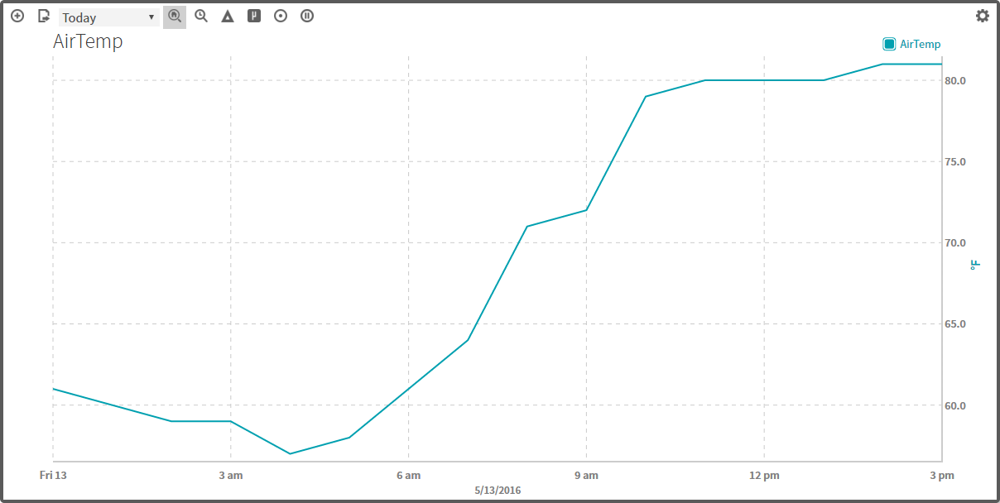

***

# SVG usages in Niagara

Circular Gauge is also built with BajaScript, bajaux, SVG, and D3!

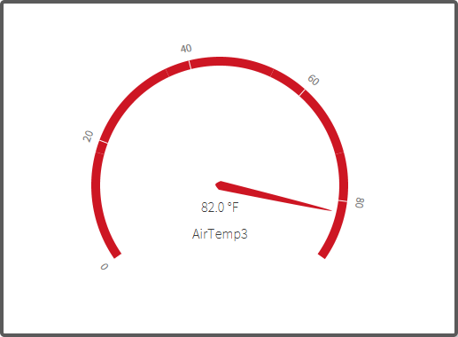

***

# SVG usages in Niagara

`kitPxN4svg`: updated Graphics package for N4

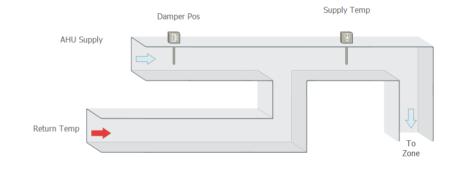

***

# Why use SVG?

SVG drawings are based on mathematical formulas, so their quality stays the same
from small scale to large. `<svg width="800" height="515" viewBox="0 0 1600 1030">`

***


# Why use SVG?

SVG at a large scale is still crisp! `<svg width="800" height="515">`

***

##Intro to D3

Bind arbitrary data to a DOM

Apply data-driven transformations

Extremely fast

Functional style allows for reuse


***

## D3: Working with selections

Use standard CSS selectors

`select()` for first element

`selectAll()` for all

```html
<svg width ="800" height="200">
  <circle r="100" cx="150" cy="100" fill="darkCyan" class="large"></circle>
  <circle r="75" cx="375" cy="100" fill="blue" class="medium"></circle>
  <circle r="50" cx="550" cy="100" fill="black" class="small"></circle>
</svg>
```

```javascript
console.log('found', d3.selectAll('circle').size(), 'circles');
console.log('Large Radius should be 100px!:', d3.select('circle.large').style('r'));
console.log('Medium Radius should be 75px!:', d3.select('circle.medium').style('r'));
console.log('Small Radius should  be 50px!:', d3.select('circle.small').style('r'));
```

***

## Working with selections

When you apply changes to a selection, the change will apply to
`all` elements in the selection.

```html
<svg width ="800" height="200">
  <circle r="100" cx="150" cy="100" fill="darkCyan" class="large"></circle>
  <circle r="75" cx="375" cy="100" fill="blue" class="medium"></circle>
  <circle r="50" cx="550" cy="100" fill="black" class="small"></circle>
</svg>
```

```javascript
console.log('Set all circles\' fill to red or purple.');
d3.selectAll('circle')
  .style('fill', Math.round(Math.random()) ? 'red' : 'purple');
```

<svg width="800" height="200">
  <circle r="100" cx="150" cy="100" fill="darkCyan" class="large" style="fill: red;"></circle>
  <circle r="75" cx="375" cy="100" fill="blue" class="medium" style="fill: red;"></circle>
  <circle r="50" cx="550" cy="100" fill="black" class="small" style="fill: red;"></circle>
</svg>
    
***

## Working with selections

`Dynamic Properties`: Pass a callback and it will run for each element, returning the element's new value.

```html
<svg width ="800" height="200">
  <circle r="100" cx="150" cy="100" fill="darkCyan" class="large"></circle>
  <circle r="75" cx="375" cy="100" fill="blue" class="medium"></circle>
  <circle r="50" cx="550" cy="100" fill="black" class="small"></circle>
</svg>
```

```javascript
console.log('Set each circle to red or purple.')
d3.selectAll('circle')
  .style('fill', function () {
    return Math.round(Math.random()) ? 'red' : 'purple';
  });
```

<svg width="800" height="200">
  <circle r="100" cx="150" cy="100" fill="darkCyan" class="large" style="fill: red;"></circle>
  <circle r="75" cx="375" cy="100" fill="blue" class="medium" style="fill: purple;"></circle>
  <circle r="50" cx="550" cy="100" fill="black" class="small" style="fill: red;"></circle>
</svg>

***
  
## Element Creation and Destruction

`append()` adds elements to a selection and to the DOM.

`remove()` removes elements from a selection and from their parent nodes.

```html
<svg width="800" height="200">
  <circle r="100" cx="150" cy="100" fill="darkCyan" class="large"></circle>
  <circle r="75" cx="375" cy="100" fill="blue" class="medium"></circle>
  <circle r="50" cx="550" cy="100" fill="black" class="small"></circle>
</svg>
```

```javascript
d3.select('circle.small').remove();
d3.select('svg')
  .append('rect')
    .attr('class','large')
    .attr('x', 600);
console.log('Removed a small circle and added Large Rect');
```

<svg width="800" height="200">
  <circle r="100" cx="150" cy="100" fill="darkCyan" class="large"></circle>
  <circle r="75" cx="375" cy="100" fill="blue" class="medium"></circle>    
  <rect class="large" x="600"></rect>
</svg>
    
***

## D3 Data

So far we've just manipulated some DOM and that can get cumbersome.

Instead, let's let the data drive what is being displayed!

```javascript
var circles = [{className: "large", fill: 'darkCyan', cx: 150},
               {className: "medium", fill: 'blue', cx: 375},
               {className: "small", fill: 'black', cx: 550 }];

d3.select('svg').selectAll('circle')
  .data(circles) //Data Driven!
  .enter()
  .append('circle')
  .attr('class',  function (datum) { return datum.className; })
  .attr('fill', function (datum) { return datum.fill; })
  .attr('cx', function (datum) { return datum.cx; });
```

<svg width="800" height="200">
  <circle class="large" fill="darkCyan" cx="150"></circle>
  <circle class="medium" fill="blue" cx="375"></circle>
  <circle class="small" fill="black" cx="550"></circle>
</svg>

***

## D3 Data Selections

Data selections have three sub-selections:

`enter()`: selection for new elements

`update()`: existing data, existing DOM element

`exit()`: data removed, DOM removed

***

`Enter` : D3's Declarative Nature lets us set up new DOM elements for each index

```javascript
  var circles = [
      { className: "large", fill: 'darkCyan', cx: 150 },
      { className: "medium", fill: 'blue', cx: 375 },
      { className: "small", fill: 'black', cx: 550 }
  ];

  d3.select('svg').selectAll('circle')
    .data(circles)
    .enter() //causes new circles to be added for each index of Array
    .append('circle')
    .attr('class', function (datum) { return datum.className; })
    .attr('fill', function (datum) { return datum.fill; })
    .attr('cx', function (datum) { return datum.cx; });
```

<svg width="800" height="200">
  <circle class="large" fill="darkCyan" cx="150"></circle>
  <circle class="medium" fill="blue" cx="375"></circle>
  <circle class="small" fill="black" cx="550"></circle>
</svg>

***

`Enter`: Handles more data with ease

```javascript
  var circles = d3Demo.lotsOfCircleData(40); //lots of random circles
  d3.select('svg').selectAll('circle')
    .data(circles)
      .enter()
    .append('circle')
      .attr('class',  function (datum) { return datum.className; })
      .attr('fill', function (datum) { return datum.fill; })
      .attr('cx', function (datum) { return datum.cx; })
      .attr('r', function (datum) { return datum.radius; });
```

<svg width="1600" height="200"><circle class="lots" fill="#F23230" cx="806.6861100594991" r="72.62871050852957"></circle><circle class="lots" fill="#FD75DB" cx="1591.3727116863945" r="0.2317310017956542"></circle><circle class="lots" fill="#49A28B" cx="1300.1183243133664" r="67.5483839174427"></circle><circle class="lots" fill="#8FD4AE" cx="519.1936963542581" r="28.448860862963343"></circle><circle class="lots" fill="#0A0F95" cx="1234.2390796731702" r="91.37237459504152"></circle><circle class="lots" fill="#66A0FA" cx="846.9740468951923" r="46.15661288249338"></circle><circle class="lots" fill="#A98883" cx="274.5874416404707" r="81.59412975885681"></circle><circle class="lots" fill="#387C89" cx="141.10081107202248" r="64.69869200811682"></circle><circle class="lots" fill="#6A1504" cx="331.40187983958424" r="63.07739342115275"></circle><circle class="lots" fill="#33DFC5" cx="1349.4859892539632" r="77.77524901940276"></circle><circle class="lots" fill="#B471B0" cx="645.3136647089287" r="7.337469225414783"></circle><circle class="lots" fill="#1B5819" cx="914.37781111783" r="47.81632426624949"></circle><circle class="lots" fill="#1370BB" cx="717.8677559200544" r="25.129961207093743"></circle><circle class="lots" fill="#0F6BC3" cx="1129.465176894799" r="57.97303869798074"></circle><circle class="lots" fill="#077D4E" cx="514.777993070975" r="8.429596978678955"></circle><circle class="lots" fill="#D8811B" cx="693.4037021283046" r="24.03627192910871"></circle><circle class="lots" fill="#928E1C" cx="554.0425014534189" r="52.809676847625695"></circle><circle class="lots" fill="#C63CCE" cx="566.8107971970699" r="82.13774832906434"></circle><circle class="lots" fill="#DAA0CE" cx="1188.8884192522048" r="61.84825064451345"></circle><circle class="lots" fill="#1C6092" cx="172.25783775631598" r="60.97547491840394"></circle><circle class="lots" fill="#619AA2" cx="1155.883101657756" r="79.86407866372345"></circle><circle class="lots" fill="#BFD11E" cx="1070.3807983825595" r="99.50537755379109"></circle><circle class="lots" fill="#3C72B8" cx="93.81382565787888" r="38.16372697805062"></circle><circle class="lots" fill="#47DB51" cx="646.0358516129518" r="5.680838974145086"></circle><circle class="lots" fill="#BF18F5" cx="114.22713791352095" r="94.84599068843242"></circle><circle class="lots" fill="#860103" cx="171.5803326060925" r="92.76360699624671"></circle><circle class="lots" fill="#240AEF" cx="1335.1703733039415" r="99.12366036125384"></circle><circle class="lots" fill="#5A638C" cx="67.89238882860289" r="18.11955563151053"></circle><circle class="lots" fill="#26B53C" cx="306.6448519562673" r="14.699517497940473"></circle><circle class="lots" fill="#B45C70" cx="172.64474620623992" r="73.91278921888633"></circle><circle class="lots" fill="#68BC3C" cx="538.9254921348016" r="40.64914590669409"></circle><circle class="lots" fill="#C0E5D2" cx="487.9610973917671" r="41.917596362301815"></circle><circle class="lots" fill="#5C0122" cx="993.5617255876622" r="20.6197418463695"></circle><circle class="lots" fill="#354253" cx="229.1935413166794" r="19.283597684348376"></circle><circle class="lots" fill="#8BDF1E" cx="208.19752802800798" r="48.50657995051135"></circle><circle class="lots" fill="#17AE96" cx="1088.7687309178882" r="82.31990603127115"></circle><circle class="lots" fill="#658706" cx="1441.3940520595197" r="91.13858257876772"></circle><circle class="lots" fill="#468F29" cx="1377.0713814542426" r="7.177738390121791"></circle><circle class="lots" fill="#65FEAA" cx="633.9239758128546" r="68.29394471202394"></circle><circle class="lots" fill="#50F649" cx="182.943872962991" r="56.04636408597487"></circle></svg>

***

`Update` : Let the data modifications drive how the DOM changes too

```javascript
var data = d3Demo.lotsOfCircleData(40);
    dataSelection = d3.select('svg').selectAll('circle').data(data),
    update = dataSelection;

setInterval(function () {
  var i;
  for (i = 0 ; i < data.length ; i++) {
    data[i].fill = d3Demo.getRandomColor();
  }

  // update manipulates existing elements each time the data is changed.
  update.style('fill', function (datum) { return datum.fill; })
}, 2000);
```

***

`Exit` : Let the data cleanup the DOM.

```javascript
var circles = d3.selectAll('circle');

setTimeout(function(){
  var data = circles.data([]);
  data.exit().remove();
}, 3000);
```

***

## D3 Transitions

Interpolate styles and attribute changes over time.

```html
<svg width ="800" height="225">
  <circle r="100" cx="150" cy="100" fill="darkCyan" class="large"></circle>
  <circle r="75" cx="375" cy="100" fill="blue" class="medium"></circle>
  <circle r="50" cx="550" cy="100" fill="black" class="small"></circle>
</svg>
```

```javascript
d3.selectAll('circle')
  .transition().duration(1000)
  .style('fill-opacity', 0)
  .remove();
```

***

## Events

The selection's `on()` function adds event handlers to elements.

```html
<svg width ="800" height="200">
  <circle r="100" cx="150" cy="100" fill="darkCyan" class="large" cursor="pointer"></circle>
  <circle r="75" cx="375" cy="100" fill="blue" class="medium" cursor="pointer"></circle>
  <circle r="50" cx="550" cy="100" fill="black" class="small" cursor="pointer"></circle>
</svg>
```

```javascript
d3.selectAll('circle').on('click', function () {
  d3.select(this)
    .transition().duration(1000)
    .style('fill-opacity', 0)
    .remove();
});
```

***

# D3 Animations

Transition multiple times for fun effects!

```html
<svg width ="1200" height="225">
  <circle r="100" cx="150" cy="100" fill="darkCyan" class="large" cursor="pointer"></circle>
  <circle r="75" cx="375" cy="100" fill="blue" class="medium" cursor="pointer"></circle>
  <circle r="50" cx="550" cy="100" fill="black" class="small" cursor="pointer"></circle>
</svg>
```

```javascript
d3.selectAll('circle').on('click', function () {
  d3.select(this)
    .transition().duration(1000)
    .attr('cx', 1100)
    .transition().duration(1000)
    .attr('cx', 100)
    .style('fill-opacity', 0)
    .remove();
});
```

***

# D3 Animations

Or transition all at once!

```javascript
var circles = d3.select('svg').selectAll('circle');
setInterval(function () {
  circles
    .transition().duration(2000)
    .style('fill', function () {
      return d3Demo.getRandomColor();
    })
    .style('fill-opacity', function () {
      return Math.round(Math.random());
    })
    .attr('cx', function () {
      return 1100 * Math.random();
    });
}, 2000);
```

***

## D3 Reusable Charts - C3

The C3 library is one example of D3 reusable charts.

```javascript
function generateChart(){
  var c3Chart = c3.generate({
    bindto: '#parent',
    data: {
      columns: [
        ['data1', 30, 200, 100, 400, 150, 250],
        ['data2', 50, 20, 10, 40, 15, 25]
      ],
      type: "line"
    }});
}
```

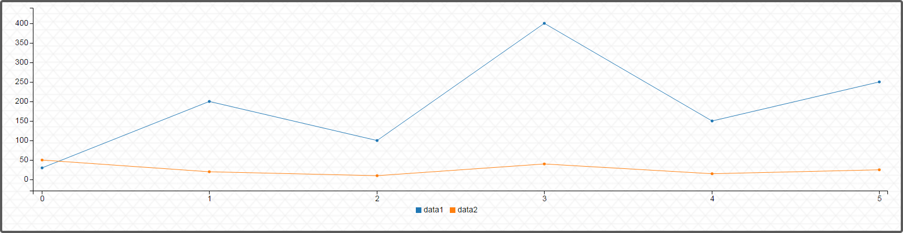

***

## D3 Reusable Charts - C3

Let's customize the x-axis.

```javascript
var chart = c3.generate({
  bindto: '#parent',
  data: {
    x: 'x',
    columns: [ d3Demo.days(6), //6 recent Date objects
      ['data1', 30, 200, 100, 400, 150, 250],
      ['data2', 50, 20, 10, 40, 15, 25]
    ]
  },
  axis: {
    x: {
      type: 'timeseries',
      tick: {
        format: '%m/%d'
      }
    }
  }
});
```

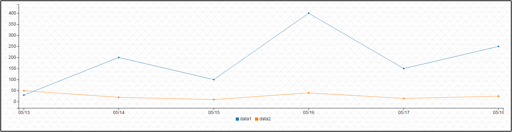

***

## D3 Reusable Charts - C3

Once we have our initial data, we can add more data with `c3.flow`.

```javascript
var c3Chart = d3Demo.generateChartX(); //previous example

setTimeout(function () {
  c3Chart.flow({
    columns: [ d3Demo.days(12), //12 recent Date objects
      ['data1', 30, 200, 100, 400, 150, 250, 30, 200, 100, 400, 150, 250],
      ['data2', 50, 20, 10, 40, 15, 25, 50, 20, 10, 40, 15, 25],
    ],
    duration: 6000,
  });
}, 200);
```

***

## D3 Reusable Charts - C3

Changing the chart type is easy. Let's use D3 Eventing on the `<select>`.

```html
<div id='body'>
  Select Chart Type:
  <select id="chartType" class="d3DemoSelect">
    <option name="bar">bar</option>
    <option name="line">line</option>
    <option name="pie">pie</option>
  </select>
  <div id="parentC3"></div>
</div>
```

```javascript
var chartTypeSelection = d3.select("#chartType");
chartTypeSelection.on("change", function(){
  var chartType = chartTypeSelection.node().value,
      chart = c3.generate({
        bindto: '#parentC3',
        data: {
          columns: [
            ['data1', 30, 200, 100, 400, 150, 250],
            ['data2', 50, 20, 10, 40, 15, 25]
          ],
          type: chartType
        }});
});
```

***

## D3 Reusable Charts - Circular Heat Map

Another simple-to-create, open-source reusable Chart.

```javascript
var chart = circularHeatChart()
   .innerRadius(20)
   .radialLabels(["Monday", "Tuesday", "Wednesday", "Thursday", "Friday", "Saturday", "Sunday"])
   .segmentLabels(["12am", "1am", "2am", "3am", "4am", "5am", "6am", "7am", "8am", "9am", "10am", "11am",
   "12pm", "1pm", "2pm", "3pm", "4pm", "5pm", "6pm", "7pm", "8pm", "9pm", "10pm", "11pm"]);

var data = [];
for (var i = 0; i < 168; i++) data[i] = Math.random();

d3.select('#parent')
   .selectAll('svg')
   .data([data])
   .enter()
   .append('svg')
   .attr('class', 'd3DemoCircle')
   .call(chart)
```

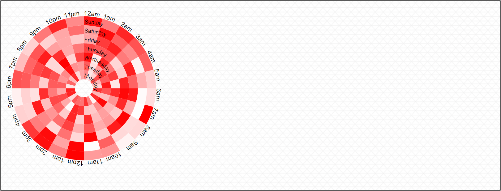

***

## Let's get in some Niagara Historical Data!

```javascript
function resolvePoints(history) {
  var points = [];
  return history.cursor({
    each: function () {
      var dataPoint = {
        x: this.get("timestamp"),
        y: this.get("value")
      };
      points.push(dataPoint);
      console.log(dataPoint.x + "     " + dataPoint.y);
    },
    limit: -1
  }).then(function(){
    return points;
  });
};
```

***

## Circular Heat Map: How to Drive the Data

168 hours in a week (24 hours per day, 7 days)

Increases color over week to confirm the buckets

```javascript
var data = [];
for (var i = 0; i < 168; i++) data[i] = i; //no longer random

d3Demo.circularHeatChart(data);
```

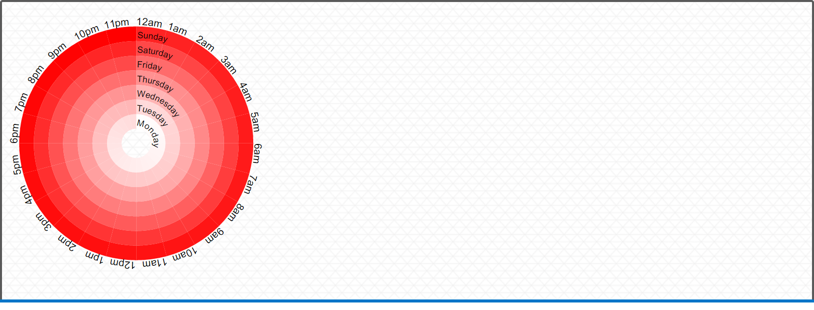

***

## Lets organize the data into a Weekly Average, But How?

Dates can be tricky - let's use Moment.js.

`Moment.js`: Parse, validate, manipulate, and display dates in JavaScript.

```javascript
var now             = moment(),
    hour            = now.hour(),
    day             = now.day(),
    startOfDay      = moment().startOf("day"),
    july4th         = moment(new Date(2016, 6, 4)), //accepts JavaScript Date
    untilHoliday    = july4th.fromNow();

console.log("now:          " + now.toDate());
console.log("hour:         " + hour);
console.log("day:          " + day);
console.log("startOfDay:   " + startOfDay.toDate());
console.log("july4th:      " + july4th.toDate());
console.log("untilHoliday: " + july4th.fromNow());
```

***

## AbsTime to Moment.js is easy

Just convert to a JavaScript Date.

```javascript
var absTimeNow    = baja.AbsTime.now(),
    dateNow       = absTimeNow.getJsDate(),
    momentNow     = moment(dateNow),
    startOfDay    = moment(momentNow).startOf("day"), //safe copy
    startAbsTime  = baja.AbsTime.make({ jsDate: startOfDay.toDate() });

console.log("absTimeNow:    " + absTimeNow);
console.log("momentNow:     " + momentNow.toDate());
console.log("---");
console.log("startOfDay:    " + startOfDay.toDate());
console.log("startAbsTime:  " + startAbsTime);
```

***

## Now we are ready to place the values in the Heat Map

```javascript
d3Demo.loadHistoryExample().then(function (points) {
  var resultPoints = [],
      buckets = 24 * 7; //7 days, 24 hours

  points.forEach(function (point) {
    var m      = moment(point.x.getJsDate()), // baja.AbsTime to moment()
        bucket = m.hour() + m.day() * 24;
    resultPoints[bucket] = point.y;
  });

  var chart = d3Demo.circularHeatChart(resultPoints);
});
```

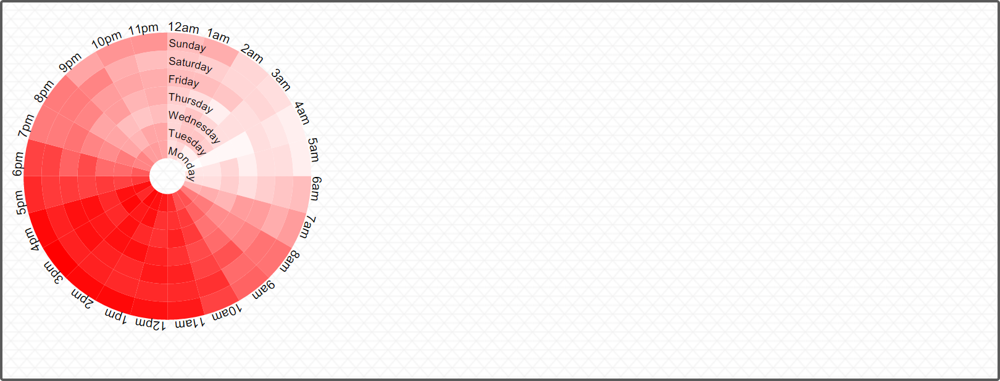

***

## The Heat Map needs some interactions - let's add a mouse over to highlight the path

```javascript
d3Demo.circularHeatChartWithData().then(function () { //previous example
   d3.select("#parent").selectAll('path')
     .on("mouseover", function () {
       var d3Elem = d3.select(this);
       d3Elem.style("stroke", "#595959") //gray
         .style('stroke-width', '3px');

       this.parentNode.appendChild(this); //move to Top
     })
     .on("mouseout", function () {
       var d3Elem = d3.select(this);
       d3Elem.style("stroke", "")
         .style('stroke-width', "");
     });
  });
```

***

## Starting a `bajaux` D3 Widget

```javascript
var CircularHeatChart = function CircularHeatChart() {
  Widget.apply(this, arguments);
  var props = this.properties();
  props.add({ name: 'rangeStart', value: 'white', typeSpec: 'gx:Color' });
  props.add({ name: 'rangeEnd', value: 'red', typeSpec: 'gx:Color' });
};
```

Let's expose some `Properties` to the Px Editor.

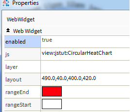

***

# Demo in Workbench

***

#Want to learn more?

D3 Tutorials: [https://github.com/mbostock/d3/wiki/Tutorials](https://github.com/mbostock/d3/wiki/Tutorials)

C3 Getting Started: [http://c3js.org/gettingstarted.html](http://c3js.org/gettingstarted.html)

Niagara Doc Developer: [module://docDeveloper/doc/index.html](module://docDeveloper/doc/index.html)

- Breakout Session on 'Web Technology'
- Application Track
- Monday & Tuesday @ 2:15 PM
- Hosted by Andrew Jackson and Ross Schwalm

***

# Dashboard Widgets

***

# What is a Dashboard Widget?

Introduced in Niagara 4.0

Configure Widget data without Px Editor

Dashboard data saved per User (dashboard data === user data)

Dashboard data is **not** saved to the Px file

Supported Widgets are...

* Web Chart
* Circular Gauge

***

# Dashboard Configuration

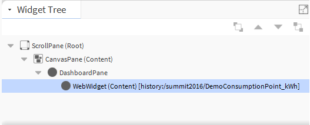

Add `DashboardService` to a Station

Add `DashboardPane` to a Px page

Add `bajaux` Widget to `DashboardPane` `content`

***

# Dashboard Commands


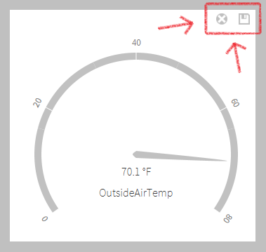

Commands are injected into a Dashboard Widget...

**Save**: saves the Widget (calls `save` -> `doSave`)

**Clear**: clears dashboard data from the Widget and refreshes the browser.

***

# Widget to Dashboard Widget

Add a `bajaux` Widget `Property` with the `dashboard` attribute.

Any data stored in this `Property` will be saved per user.

If this `Property` is changed, the Widget is automatically marked as modified.

```javascript
var MyDashboardWidget = function () {
  Widget.apply(this, arguments);

  this.properties()
    .add({
      name: "myDashboardProperty",
      value: "",
      dashboard: true,
      readonly: true
    });
};
```

***

# Is my Widget in a Dashboard?

Runtime check to determine if a Widget is in a dashboard via the `dashboard` Property...

```javascript
var MyDashboardWidget = function () {
  Widget.apply(this, arguments);

  this.properties()
    .add({
      name: "dashboard", // True if Widget is in a Dashboard!
      value: false,
      hidden: true,
      readonly: true
    })
    .add({
      name: "myDashboardProperty",
      value: "",
      dashboard: true,
      readonly: true
    });
};
```

***

# Drag and drop

***

# Basic drag and drop

```html
<div class="dragEx">
  
  <div class="dragTo">Drag here!</div>
</div>
```

```javascript
$(".dragEx .dragFrom")
  .on("dragstart", function (e) {
    e.originalEvent.dataTransfer.setData("Text", $(this).attr("src"));
  });

$(".dragEx .dragTo")
  .on("dragover", function (e) { e.preventDefault(); })
  .on("drop", function (e) {
    e.preventDefault();
    $(e.target).html("&lt;img src='" +
      _.escape(e.originalEvent.dataTransfer.getData("Text")) + "'/&gt;");
  });
```

***

# Drag and drop with Niagara data

```html
<div class="niagaraDragEx"><div class="dragFrom" draggable="true">Niagara data</div><div class="dragTo">Drag here!</div></div>
```

```javascript
$(".niagaraDragEx .dragFrom").on("dragstart", function (e) {
  dragDropUtils.toClipboard(e.originalEvent.dataTransfer, 'niagara/navnodes', [comp]);
});

$(".niagaraDragEx .dragTo")
  .on("dragover", function (e) { e.preventDefault(); })
  .on("drop", function (e) {
    e.preventDefault();

    dragDropUtils.fromClipboard(e.originalEvent.dataTransfer)
      .then(function (envelope) {
        console.log("Dropped MIME Type: " + envelope.getMimeType());
        return envelope.toJson();
      })
      .then(function (json) {
        console.log("Dropped ORD -> " + json[0].ord + " and Type -> " + json[0].typeSpec);
      });
  });
```

***

# Dashboard Summary

Properties with `dashboard` attribute store data for the Dashboard.

Special `dashboard` Property used to determine if Widget is on Dashboard.

Use `bajaux/dragdrop/dragDropUtils` to enable Niagara drag and drop.

Drop should update Property marked with `dashboard` attribute and re-render Widget.

Widget `doLoad` should check for Dashboard data before loading.   

***

# Dashboard Heat Map Demo

***

# Wrap-up

***

# Thanks for attending Developer Bootcamp.

We hope you've found the information useful.

***

# To wrap up,

Here's a fun little demo showcasing some of the technologies you've learned about today.

Like this entire slideshow, it's HTML/JS-based and runs on a Station.

***

# It's a Niagara-powered music synthesizer!

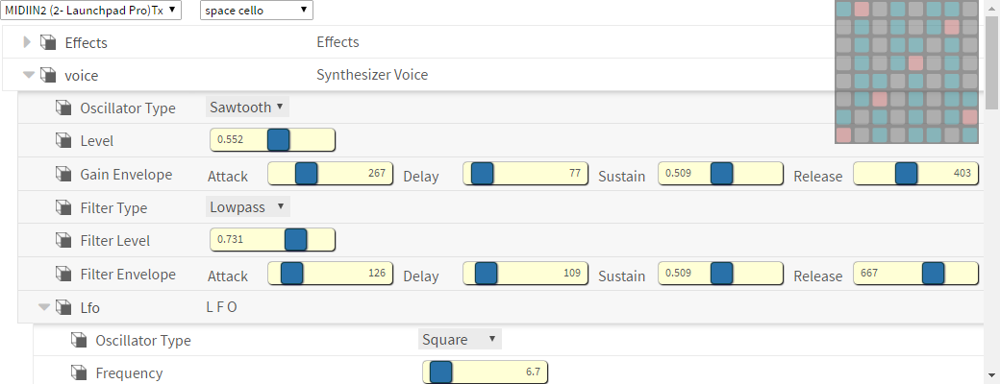

***

# It utilizes the Common Object Model.

It's made up of the familiar `BComponent`s, `BStruct`s, and `BSimple`s that make the Niagara Framework easy to build upon.

***

# It's based on a MIDI driver built on the `ndriver` framework.

Thanks, Joe Chandler, for your help on this.

***

# It's compiled using Gradle.

Including all the JavaScript!

***

# It uses the Web Audio API.

It works in Chrome, Firefox, and Microsoft Edge.

***

# Data transfer is done with BajaScript.

The MIDI driver in the station picks up on the music events from my pad and fires a `Topic`. BajaScript subscribes to it in the browser.

***

# Synth configuration is BajaScript, too!
  
A synth voice is just a `Component` in the station.

***

# The UI is `bajaux`-based.
  
This `Widget` is written with BajaScript, `bajaux`<br/> and `D3`, and keeps in sync with the pad in real time!

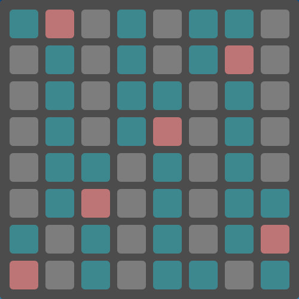

***

# It's on Github.

Go check it out!
  
[https://github.com/tridium](https://github.com/tridium)

***

# From all of us at Tridium,

## Thanks for your support,
      
## and enjoy the rest of the Summit!