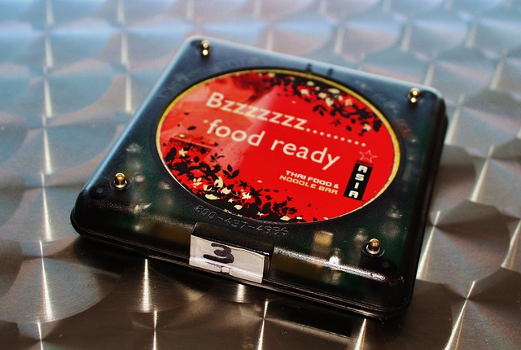
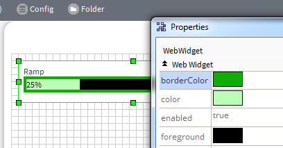
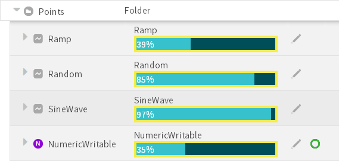
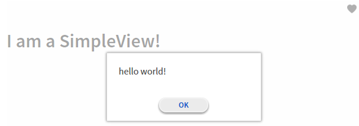
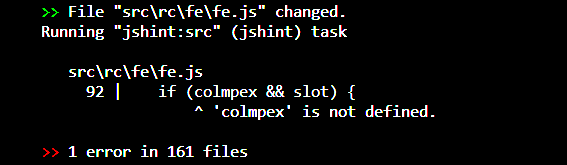
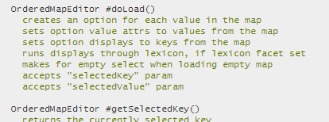
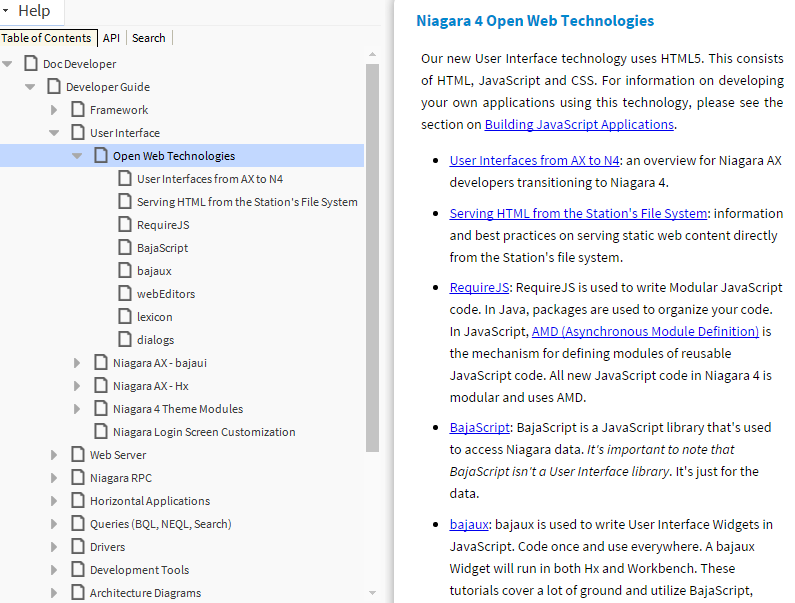
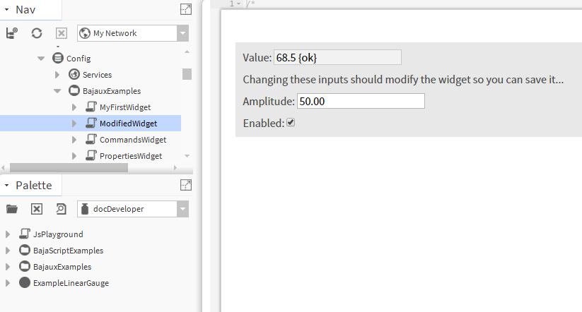

# Web Development in Niagara 4

* Logan Byam, JJ Frankovich, and Gareth Johnsom
* Software Engineers @ Tridium

***

Note: this slideshow was originally delivered as a live, HTML/JS-based
demonstration running in a browser. Therefore, Powerpoint slides were not
created. This is a Markdown export of the original text and images.

***

# UI Development Basics

***

# Jetty

Open Source Java Web Server

Secure

Servlet version 3.1 compliant

Supports Web Sockets

***

# Servlets in Niagara

`BWebServlet`: Servlet Components in a Station.

`BServletView`: Servlets that are Niagara Views.

`HttpServlet`: traditional Java Web Servlets.

`NiagaraRpc`: Remote Procedure Calls new to Niagara 4.1.

***

# Servlets as Components

***

# Servlet Components - Step 1

Extend `javax.baja.web.BWebServlet`, implement `doGet()`...

```java
@NiagaraType
public class BMyWebServlet extends BWebServlet
{
  /* Auto-generated code goes here...*/

  public void doGet(WebOp op) throws Exception
  {
    op.setContentType("text/html; charset=utf-8");

    op.getWriter().write("<!DOCTYPE html><html><body>" + 
                         "<h1>Hello Web Servlet!</h1>" +
                         "</body></html>");
  }
}
```

*** 

# Servlet Components - Step 2

Implement `servletName` Property...

```java
@NiagaraType
@NiagaraProperty(
  name = "servletName",
  type = "baja:String",
  flags = Flags.HIDDEN | Flags.READONLY,
  defaultValue = "myServlet"
)
public class BMyWebServlet extends BWebServlet
{
  ...
}
```

***

# Servlet Components - Step 3

Run slot-o-matic

Add to the module's palette

Build

Start Station

Add the Servlet to the Station from the palette

Open a browser and navigate to [https://localhost/myServlet](/myServlet)

***

# Servlets as Views

***

# Servlet Views - Step 1

Extend `javax.baja.web.BServletView`, implement `doGet()`, register view as an agent...

```java
@NiagaraType(agent = @AgentOn(types = {"webServerDemo:MyComponent"}))
@NiagaraSingleton
public final class BMyServletView extends BServletView
{
  private BMyServletView() {}

  /* Auto-generated code goes here...*/
  
  public void doGet(WebOp op) throws Exception
  {
    op.setContentType("text/html; charset=utf-8");
    
    op.getWriter().write("<!DOCTYPE html><html><body>" + 
                         "<h1>Hello Servlet View!</h1>" + 
                         "</body></html>");
  }
}
```

***

# Servlet Views - Step 2

Slot-o-matic, build etc.

Open browser to a MyComponent instance...

[https://localhost/ord/station:|slot:/MyComponent](/ord/station:|slot:/MyComponent)

***

# Standard Java Servlets

***

# `HttpServlet` - Step 1

Extend `javax.servlet.http.HttpServlet`...

```java
public class MyHttpServlet extends HttpServlet
{
  @Override
  protected void doGet(HttpServletRequest req, HttpServletResponse resp)
    throws ServletException, IOException
  {
    BUser user = BUser.getCurrentAuthenticatedUser();
    String userName = user != null ? user.getUsername() : "unknown";
    String lang = req.getLocale().toLanguageTag();

    resp.getWriter().write(String.format(
      "<!DOCTYPE html><html><body>" +
      "<h1>Your user name is %s and your language is %s</h1>" +
      "</body></html>", Encode.forHtml(userName), Encode.forHtml(lang)));
  }
}
```

***

# `HttpServlet` - Security

Validate all inputs. Check what you're given.

Use `org.owasp.encoder.Encode` to prevent XSS (cross-site scripting) attacks.

Follow OWASP best practices guidelines - [https://www.owasp.org](https://www.owasp.org)

When resolving ORDs, pass in a user Context.

When working with Components, check security permissions.

***

# HttpServlet - Step 2

Add `WEB-INF/web.xml`:

```xml
<?xml version="1.0" encoding="UTF-8"?>
<web-app>
  <display-name>Web Server Demo Servlets</display-name>

  <servlet>
    <servlet-name>myHttpServlet</servlet-name>
    <servlet-class>demo.webserver.MyHttpServlet</servlet-class>
  </servlet>
  <servlet-mapping>
    <servlet-name>myHttpServlet</servlet-name>
    <url-pattern>/myFirstServlet/rocks/*</url-pattern>
  </servlet-mapping>
</web-app>
```

***

# HttpServlet - Step 3

Ensure `web.xml` is picked up during the build...

```
jar {
  from('src') {
    include 'WEB-INF/*.xml'
  }
}
```

Build, start Station, etc.

Open browser to...

[https://localhost/webServerDemo/myFirstServlet/rocks](/webServerDemo/myFirstServlet/rocks)

***

# Remote Procedure Calls

***

# `NiagaraRpc`

Make JSON Remote Procedure Calls via...

* BajaScript
* RESTful Web Server
* Fox

Secure

Annotation based

Transport agnostic

***

# `NiagaraRpc` Server

Annotate a Java method...

```java
@NiagaraRpc(
  permissions = "RWI",
  isSecure = true,
  transports = {
    @Transport(type = web),
    @Transport(type = box),
    @Transport(type = fox)
  }
)
public List<String> myFirstRpc(Context cx)
{
  return Arrays.asList("Pugh", "Pugh", "Barney McGrew", "Cuthbert", "Dibble", "Grub");
}
```

***

# `NiagaraRpc` Client

Invoke via BajaScript...

```javascript
require(["baja!"], function(baja) {
  baja.Ord.make("station:|slot:/MyComponent").get()
    .then(function (comp) {
      return comp.rpc("myFirstRpc");
    })
    .then(function (names) {
      console.log("The RPC response: " + names.join(","));
    });
});
```

***

# `NiagaraRpc` Client

Invoke via AJAX...

```javascript
require(["jquery"], function($) {
  $.ajax("/rpc/myFirstRpc/station:%7Cslot:/MyComponent", {
     method: "POST",
     dataType: "json"
  })
  .then(function (obj) {
    console.log("The RPC response: " + obj.value.join(","));
  });
});
```

***

# `NiagaraRpc` Client

Invoke via Fox...

```java
BFoxProxySession session = BFoxProxySession.make(someOtherHost, 
  4911, 
  /*useFoxs*/true, 
  "aUserName", 
  superComplicatedPassword);

session.engageNoRetry("testSession");

Optional<List<String>> response = session.rpc(
  BOrd.make("station:|slot:/MyComponent"), "myFirstRpc");

if (response.isPresent())
{
  ...
}  

session.disengage("testSession");
```

***

# `NiagaraRpc` Overview

RPC methods can be static or instance based

Supports multiple arguments

Java Collection encoding/decoding

Developer can define security permissions

Developer can define support transports

Data format is pure JSON

***

# Web Server Conclusion

Create Servlets in a variety of ways via...

* Components
* Views
* Standard Java technology

`NiagaraRpc` provides a super simple way to create RPC calls!

***

# Client UI Technologies

***

# What's new in N4?

BajaScript v2

Workbench Web Browser

`bajaux`

***

# Why all this new stuff?

Applet's days are numbered

`bajaui` outdated

Capitalize on open source and innovation

***

# BajaScript v2

***

# What is BajaScript?

- JavaScript data API
- Interact with a Niagara station
  - Resolve and Subscribe
  - Database queries
  - Tags and Relations
- Extensible
- Not a UI framework

***

# Resolve and Subscribe

Keep up to date with Niagara data values.

```javascript
var sub = new baja.Subscriber();

sub.attach('changed', function (prop) {
  if (prop.getName() === 'out') {
    console.log('changed: ' + this.get(prop));
  }
});

baja.Ord.make('station:|slot:/Ramp').get({ subscriber: sub });
```

***

# Database Queries

Retrieve data from the history and alarm databases.

```javascript
baja.Ord.make('history:/jstut/Ramp').get()
  .then(function (table) {
    return table.cursor({
      each: function (record) {
        console.log(record.get('timestamp') + ': ' + record.get('value'));
      }
    });
  });
```

***

# Tags and Relations

Query for tag and relation data from components.

```javascript
baja.Ord.make('station:|slot:/Ramp').get()
  .then(function (ramp) {
    return Promise.join(ramp.tags(), ramp.relations());
  })
  .spread(function (tags, relations) {
    console.log(tags.getAll().map(tagToString).join('\n'));

    console.log(relations.getAll().map(relationToString).join('\n'));
  });
```

***

# Unit Database support

Convert numeric values between units of measure.

```javascript
baja.UnitDatabase.get()
  .then(function (db) {
    db.getQuantities().forEach(function (q) {
      var quantityName = q.getName(),
          unitNames = _.map(q.getUnits(), toUnitName);

      console.log(quantityName, unitNames.join(', '));
    });
  });

function toUnitName(unit) { return unit.getUnitName(); }
```

***

# Promises

Promises are new in BajaScript v2.

Interact with other promise-based libraries.

(Callbacks still work.)

[http://bluebirdjs.com](http://bluebirdjs.com)

***

# What is a Promise?

A unit of asynchronous work

Can be fulfilled or rejected

Bring `try/catch/finally` semantics to asynchronous code

Can be orchestrated / grouped together

***

# A Promise is like...



***

# Promise example

```javascript
Promise.join(
  baja.Ord.make('station:|slot:/Services').get(),
  baja.Ord.make('station:|slot:/Drivers').get()
)
  .spread(function (services, drivers) {
    console.log('resolved both components');
    console.log(services.getNavOrd());
    console.log(drivers.getNavOrd());
  });
```

***

# `try/catch/finally`

```javascript
Promise.try(function () {
  return baja.Ord.make('station:|slot:/Schwervices').get();
})
.catch(function (err) {
  console.log('failed to resolve Services: ' + err);
})
.finally(function () {
  console.log('this runs no matter what');
});
```

***

# Offline support

As of 4.2, BajaScript can be used to configure offline BOG files in Workbench.

Implement `BIOffline` to mark a field editor or type extension as supporting
offline mode.

***

# RequireJS

- Keep JS modular
- Load the code you need, when you need it

```javascript
require(['baja!'], function (baja) {
  baja.outln('now bajascript is running.');
});
```

***

# User interface framework: `bajaux`

***

# What is `bajaux`?

`bajaux`

is an **HTML5 widget framework**

that **integrates** with the Niagara Framework.

We used it to write a new Property Sheet, Web Charts, Search, and more.

***

# What is a `Widget`?

Self-contained UI element in the browser.

Can be small and simple, like a button.

Or made of many child `Widget`s, like a Property Sheet.

It can hold a data value.

It can **integrate** with Workbench, the web Profile, Px, and Hx.

***

# How to write a `bajaux` Widget

You will need:

* HTML.
* CSS.
* JavaScript.

***

# Key API: `Widget`

Base class from which all `Widget`s inherit.

Specify its behavior by overriding certain functions.

```javascript
require(['bajaux/Widget'], function (Widget) {
  var MyWidget = function MyWidget() {
    Widget.apply(this, arguments);
  };
  MyWidget.prototype = Object.create(Widget.prototype);
});
```

***

# Key API: `fe`

I have a __Baja value__.

I want a `Widget` for it __here__.

I want it to __just work__.

```javascript
require(['nmodule/webEditors/rc/fe/fe'], function (fe) {
  fe.buildFor({
    value: false,
    dom: $('#myBoolean'),
    properties: { trueText: '??', falseText: '???' }
  });
});
```

***

# `bajaux` Workflow

Make a **widget**.

**Bind** it to an element in your page.

**Load** in a value.

**Read** it back out.

**Save** changes.

***

# `bajaux` Override Points

`doInitialize()`: bind a Widget to a DOM element (once)

`doLoad()`: load a value in (multiple times)

`doRead()`: read the current state of the Widget

`doSave()`: commit changes made to the Widget

`doDestroy()`: release resources held by the Widget

***

# Example Widget


```javascript
fe.buildFor({
  value: 50,
  dom: $('#slider'),
  type: RangeSlider,
  properties: { min: 0, max: 100 }
});
```

***

# `doInitialize()`

Bind the `Widget` to an HTML element. Call it __once__.

```javascript
RangeSlider.prototype.doInitialize = function (dom) {
  var that = this;
  dom.addClass('RangeSlider')
     .html(template(_.extend({ id: that.generateId() }, that.properties().toValueMap())));

  dom.on('change input', 'input', function () {
    that.$updateDisplay();
    that.setModified(true);
  });

  dom.on('mousewheel', 'input', function (e) {
    var props = that.properties(),
        range = props.getValue('max') - props.getValue('min'),
        step = props.getValue('step') || (range / 1000);
    that.doLoad(that.doRead() + step * (e.originalEvent.wheelDelta > 0 ? 1 : -1));
    that.setModified(true);
  });
};
```

***

# `doLoad()`

Give it a value, and the value gets loaded into the widget. Call it __many__
times.

```javascript
RangeSlider.prototype.doLoad = function (value) {
  this.$getInput().val(String(value));
  return this.$updateDisplay();
};

fe.buildFor({
  value: 250, type: RangeSlider, dom: $('#slider'),
  properties: { min: 0, max: 1000, step: 25 }
})
  .then(function (editor) {
    setInterval(function () { editor.load(Math.random() * 1000); }, 400);
  });
```

***

# `doRead()`

Read the current state of your widget.

```javascript
RangeSlider.prototype.doRead = function () {
  return parseFloat(this.$getInput().val());
};

$('#slider').on(events.MODIFY_EVENT, function (e, ed) {
  ed.read().then(console.log);
});

fe.buildFor({
  value: 500, type: RangeSlider, dom: $('#slider'),
  properties: { min: 0, max: 1000, step: 25 }
});
```

***

# Stay up to date

```javascript
baja.Ord.make('station:|slot:/bajaux/ReadonlyDouble').get()
  .then(function (numeric) {
    console.log('slot type: ' + numeric.getSlot('double').getType());
    console.log('slot facets: ' + numeric.getFacets('double'));
    return fe.buildFor({
      complex: numeric,
      slot: 'double',
      dom: $('#slider'),
      type: RangeSlider
    });
  });
```

***

# Save changes

```javascript
baja.Ord.make('station:|slot:/bajaux/EditableDouble').get()
  .then(function (numeric) {
    numeric.attach('changed', function (prop) {
      console.log('prop ' + prop + ' changed to ' + this.get(prop));
    });

    // for a Simple slot, fe.buildFor makes saving automatic.
    return fe.buildFor({
      complex: numeric, slot: 'double', dom: $('#slider'), type: RangeSlider
    });
  })
  .then(function (editor) {
    $('#saveButton').on('click', function () { editor.save(); });
  });
```

***

# `properties()`

```java
function SimpleGauge() {
  Widget.apply(this, arguments);
  var props = this.properties();
  props.add({ name: 'color', value: '#36C1CC', typeSpec: 'gx:Color' });
  props.add({ name: 'borderColor', value: '#F6EC46', typeSpec: 'gx:Color' });
  props.add({ name: 'foreground', value: '#000000', typeSpec: 'gx:Color' });
}
```

Use `properties()` to expose properties you can change in the Px editor.



***

# Framework integration

Create a Java class that tells the framework where to find your JS code.

Register it as an agent on a Type.

***

```java
/* package and imports */
  
@NiagaraType( agent = @AgentOn(types={"control:NumericPoint"}) )
public class BSimpleGauge extends BSingleton
  implements BIJavaScript, BIFormFactorMini
{
  @Override
  public JsInfo getJsInfo(Context cx) { return JS_INFO; }

  private static final JsInfo JS_INFO = JsInfo.make(
    BOrd.make("module://webEditors/rc/gauge/SimpleGauge.js")
  );
}
```



***

# Workbench integration: Commands

bajaux Widgets have Commands. Workbench can invoke them.

```javascript
function SimpleView() {
  Widget.apply(this, arguments);
  this.getCommandGroup().add(new Command({
    icon: 'module://icons/x16/heart.png',
    func: function () { dialogs.showOk('hello world!'); }
  }));
}
```



***

# Workbench integration: Events

bajaux Widgets fire events. Workbench can listen for them.

```javascript
$('#slider')
  .on(events.INITIALIZE_EVENT, function () { console.log('initialized'); })
  .on(events.LOAD_EVENT, function (e, ed) { console.log('loaded value: ' + ed.value()); })
  .on(events.MODIFY_EVENT, function (e, ed) {
    ed.read().then(function (value) { console.log('modified to: ' + value); });
  });

fe.buildFor({
  value: 500, dom: $('#slider'), type: RangeSlider,
  properties: { min: 0, max: 1000, step: 100 }
});
```

***

# Tools

***

# JSHint

- Find bugs before they occur
- Maintain code quality



***

# Karma

- Test-driven JS development
- Run tests in all browsers at once


    
***
    
# Open source tools
    
Tridium provide some open source tools to ease development.
    
- `niagara-station`: start/stop stations in Node
- `niagara-test-server`: station test utilities (login, spec filtering)
- `grunt-niagara`: smart defaults for linting and testing
- `grunt-init-niagara`: boilerplate for brand new web modules
    
[https://github.com/tridium](https://github.com/tridium)

***

# Quick note: public vs. private API



***

# Jump in and play

Check the `docDeveloper` palette.



